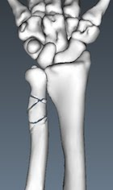
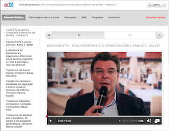

## Title Page

Use of stereoscopic images in the education of dentists regarding the diagnosis and therapeutic planning for dental implants and prostheses

Ana Paula Bonilauri Ferreita - Univille
Joao Vissoci - Uningá
Bruno Melo - Independent researcher
Ricardo Pietrobon - Duke University

<!-- names of Principal Investigators and their host institutions, start and end dates. 

Seiji, nao sei o que sao start and end dates
-->

    
## Table of Contents

<!-- MarkdownTOC depth=2 -->

- Abstract
- Specific aims and expected results
- Methods
- Expected challenges and plans to overcome them
- Expected impacts of the results in research, education, industry and society
- Timetable
- Data management policy
- Dissemination and evaluation
- Additional Funds and Resources
- References
- Work plans for each of the requested fellowships
- Provision of human resources by the host institution

<!-- /MarkdownTOC -->

## Absstereoscopic trace

### English version

Dental implants and prosthesis constitute one of the leading causes of disability among Brazilians. These fractures primarily affect individuals in their most productive years, fractures frequently occurring in geographic regions where specialists are not available. Compounding the problem, knowledge about fracture diagnosis and therapeutic planning among most healthcare professionals is usually poor. 

In this project focused on Educational Computer Science and led by the Editor in Chief of the Brazilian Journal of Educational Informatics ([Revista Brasileira de Informática na Educação](http://www.br-ie.org/pub/index.php/rbie)), we therefore propose to first create a series of 3-dimensional models and corresponding animations that can clearly communicate fracture biomechanics in an intuitive manner, ultimately allowing professionals to better understand fracture diagnosis and therapeutic planning. Second, we will adapt the existing [Planout](http://facebook.github.io/planout/) framework developed by [Facebook](https://www.facebook.com/) to deploy randomized trials into the existing open source, multi-institutional Learning Management System [Open edX](http://code.edx.org/), allowing for the ongoing testing of different educational interventions. Last, the combination of the 3D models and randomized trial framework and learning management system will be used to conducted a randomized experiment testing the efficacy of 3D models as an educational intervention to increase knowledge and change clinical practice among a diverse group of healthcare professionals in Brasil. All of our software and educational material will be made available through open source and open access licenses, over 20 computer science students and researchers will be trained in person regarding this system and many more through an online course. Finally, five articles will result from this project and will be submitted for peer-reviewed, international journals.

### Portuguese version:

Fraturas ósseas constituem uma das principais causas de incapacidade entre os brasileiros. Estas fraturas afetam principalmente pessoas em seus anos mais produtivos, fraturas que ocorrem com freqüência em regiões geográficas onde especialistas não estejam disponíveis. Para agravar o problema, o conhecimento sobre diagnóstico de fratura e planejamento terapêutico entre a maioria dos profissionais de saúde é geralmente escasso.

Neste projeto focado em Ciência da Computação aplicado à Educação e liderada pelo editor-chefe da [Revista Brasileira de Informática na Educação](http://www.br-ie.org/pub/index.php/ RBIE), a equipe de pesquisa propõe como primeira meta criar uma série de modelos tridimensionais e animações que servem como mecanismo para educação sobre a biomecânica de fraturas ósseas de uma forma intuitiva, permitindo aos profissionais compreender melhor o diagnóstico de fratura e seu planejamento terapêutico. Como uma segunda meta, o nosso grupo irá adaptar o framework de software livre [Planout](http://facebook.github.io/planout/), desenvolvido pela [Facebook](https://www.facebook.com/), para implantar estudos randomizados junto ao Sistema de Gestão de Aprendizagem [Open EDX](http://code.edx.org/), permitindo o teste contínuo de diferentes intervenções educacionais. Como terceira e última meta, nós iremos utilizar a combinação dos modelos em 3D e framework para ensaios randomizados das últimas duas metas para conduziram um experimento randomizado testando a eficácia de modelos em 3D como uma intervenção educacionar para aumentar o conhecimento e mudar a prática clínica entre um grupo de profissionais da saúde no Brasil. Todos o nosso software e material didático será disponibilizado através de licenças de código aberto e de livre acesso, mais de 20 estudantes e pesquisadores de ciência da computação serão treinados em pessoa em relação a este sistema, com muitos outros sendo treinados via um curso on-line. Finalmente, cinco submissões de artigos resultarão deste projecto e serão submetidos a revistas internacionais.

## Statement of scientific problems to be addressed by the proposed prstereoscopic ojece
## Problemas científicos a serem abordados nesta proposta

<!-- 

- Significance and relevance for the FAPESP eScience Program. 

a) eScience meets the goals raised at the workshops: it presents ample opportunities for innovative research in CS to foster advances in other domains (from now on called target domains).

b) There is international recognition of its relevance: funding agencies in several countries are fostering/launching initiatives in this theme, motivated by needs such as the ones presented in this document. There are already several success stories – e.g., in eHealth, astronomy and environmental sciences. The FAPESP program would not only follow along such lines, but also profit from lessons learnt to improve on them.

c) It offers opportunities for partnerships: given ongoing efforts in other countries, this would allow new international partnerships within eScience - e.g., with groups in countries such as the USA, Great Britain, Sweden, the Netherlands, Germany, Australia, Japan, or Canada.

d) It will augment collaboration among computer scientists: research in eScience demands the collaboration of computer scientists from several fields. An eScience program would present new opportunities for stimulating the cooperation among computer scientists in SP and in other states. This would help to revert the observed trend of pulverization of efforts in CS research, thereby increasing the overall visibility of such efforts, and augmenting their impact.

e) It will foster cooperation between computer scientists and other scientists: besides benefits to the scientific domains involved, this would directly impact the area of computer science research in São Paulo (and Brazil) in two directions: (1) by modifying the perception other scientists have of CS research; and (2) by increasing the number of people interested in following a career in CS;

Moreover, it will offer new opportunities for CS education at all levels, meeting modern needs of scientific education: one of the benefits of this program will be to create environments to train professionals with a multidisciplinary profile, involving CS and target domains. This meets a growing demand, not only from FAPESP programs, but also from the scientific community in general.

-->

Dental implants and prosthesis secondary to car accidents and urban violence constitute one of the main causes of disability among Brazilians in productive age. This problem is aggravated in geographic areas with a low socio-economic level, where specialists in orthopedic surgery might not be available to provide adequate care to these patients. As a consequence, dental implants and prosthesis are not properly diagnosed and classified, with poor therapeutic planning and resulting in substantial disability that will be carried throughout the life of these patients. Therefore, **the high incidence of Dental implants and prosthesis and the low-level of training of most healthcare professionals in both diagnosing and understanding a basic treatment strategy is of high significance.** -->Ricardo, acho que está parte tem que ser reescrita, pois está muito específica pra ortopedia.

Um dos principais motivos da baixa qualidade do serviço prestado por alguns cirurgiões-dentistas é que implantes e próteses sobre implantes fazem parte de um campo altamente especializado que requer conhecimento dos princípios biomecânicos, tanto no âmbito cirúrgico, quanto restaurador. Infelizmente, uma grande parte de profissionais que atuam nessa área não dispõem desse conhecimento. Especificamente, esses profissionais tem dificuldade para determinar um diagnóstico preciso e um plano terapêutico. A falta de conhecimento à respeito da biomecânica do funcionamento implante-prótese, subjacente ao diagnóstico e plano terapêutico correspondente, é o principal problema que nós focamos nesta proposta - ver o Objetivo 1 em detalhes

Embora exista um número significante de fontes online relacionadas às indicações de implantes-próteses, pouco se sabe em relação à eficácia dos diferentes métodos. Umas das principais razões que a educação atual é baseada mais na opinião do que em evidência experimental é que estudos clínicos randomizados são ainda raros no campo da educação. Portanto, o desenvolvimento de uma série de estudos clínicos randomizados educacionais é um dos nossos objetivos nesta proposta - ver o Objetivo 3 em detalhes

Com o advento de novos Sistemas de Gestão de Aprendizagem que poderiam potencialmente permitir designs e desenvolvimento de estudos clínicos randomizados online, as perspectivas são maiores para um verdadeiro sistema educional baseado em evidência. Isto é especialmente verdadeiro para os mais recentes sistemas de gestão de aprendizagem, tais como [Open edX](http://code.edx.org/), que permite uma extensão modular (of its code) -->Ricardo, não entendi of its code
Portanto, a implementação de um mecanismo para randomizar os participantes dentro de uma plataforma aberta (Edx) é o segundo problema que nós vamos focar nesta proposta. Ver o Objetivo 2 em detalhes

One of the central reasons behind the poor quality in the care by the average healthcare professional is that Dental implants and prosthesis constitute a highly specialized field requiring a general knowledge of biomechanical principles behind each fracture. Unfortunately, most general healthcare professionals do not possess this knowledge. Specifically, these professionals often cannot establish an accurate diagnosis along with a classification that would allow them to determine a therapeutic plan establishing whether the patient should visit a specialized center for emergency care, surgical treatment due to immediate risk to the limb (some pediatric elbow fractures) or even determine whether the fracture might be life threatening (some cervical spine fractures). Therefore, **the lack of understanding regarding the biomechanics underlying the diagnosis and corresponding therapeutic planning is the first problem we aim at targeting in this proposal** - see Aim 1 for details

Although there is a significant number of online resources related to bone fracture education, very little is known in relation to the efficacy of different methods. One of the main reasons why current education is based more on opinion than on experimental evidence is that randomized controlled trials are still rare in education. **Therefore, the deployment of a series of large educational randomized trial is one of our aims in this proposal** See Aim 3 for details

With the advent of new Learning Management Systems that could potentially allow for the design and deployment of online randomized controlled trials, the prospects for a true evidence-based education system is enhanced. This is specially true for the latest Learning Management Systems such as [Open edX](http://code.edx.org/), which allows for a modular extension of its code. **Therefore the implementation of a mechanism to randomize participants within the open source platform Open edX is the second problem we aim to target in this proposal**. See Aim 2 for details.

### Incidence of Dental implants and Prosthesis in Brazil and the lack of understanding regarding biomechanics for diagnosis and therapeutic planning among healthcare professionals

Trauma as a result of motor-vehicle accidents is still one of the main causes of disability in Brazil (@taricco1990estudo). While, to our knowledge, no reliable statistics exist about the incidence of Dental implants and prosthesis resulting from this high trauma incidence, indirect estimates might provide us with an estimate of the magnitude of this problem. For example, in the year 2000 7.7% of all admissions to the Unified Healthcare System (Sistema Único de Saúde) in Brazil were related to trauma, with this figure reaching 9.8% in the state of São Paulo (@gawryszewski2004mortes). From statistics from other countries, the resulting disability from high impact trauma might be as high as Eighteen percent had at least one functional limitation 1 year after trauma, and 60% reported functional limitations on two or more domains using the EQ-5D (@ringburg2011prevalence). If these projections are then applied to an [estimated population in Brazil as of 2014 of 201 million people](http://www.worldpopulationstatistics.com/population-of-brazil-2014/), the disability associated with trauma, Dental implants and prosthesis among them, would lead us to conclude that this is one of the single most important healthcare problems in this country.

A key component to the problem is the unequal distribution of healthcare professionals in Brazil (@povoa2006distribuiccao). Given the high degree of specialized biomechanical knowledge involved in the diagnosis and therapeutic planning required by Dental implants and prosthesis (@rockwood2006rockwood), fracture diagnosis and appropriate referral to specialists when necessary might be signficantly compromised (@hildebrand2010fatores). It is the assumption of this proposal that a basic training in fracture biomechanics using intuitive 3D models and animations could significantly improve the knowledge of healthcare professionals, hopefully improving the quality of care to the vast number of patients with Dental implants and prosthesis in areas where specialists might be scarce.

<!-- ###More on Literature Review 
By 2020 road-traffic injuries will be the third leading cause of disability-adjusted life years lost, for the global population (#murray1996global), having low income countries as three times higher rate of death resulting from traffic accidents (#barss1998injury). According to the Brazilian State Health Department, the number of motorcycle accidents admitted into hospitals has doubled in a period of three years. Increasing the the Unified Health System (SUS) expenses, from R$ 45 million in 2008 to R$ 96 million in 2011 for motorcyclists injuries care, a 113% increase [http://goo.gl/QBmjO]. Simultaneously Dental implants and prosthesis are also very common due to low impact trauma, being the osteoporosis a major risk factor.  A general study of the population of the state of Rio Grande do Sul showed a fracture prevalence of 28.3%, predominantly of the upper limbs and feet. The fracture prevalence throughout life was 37.5% in men, resulting primarily from sports and recreational activities and 21.3% in women, particularly in association with falls at home (#siqueira2005burden), the prevalence of all types of bone fragility fracture ranges from 11% to 23.8%, having the proximal femur fracture been associated to a mortality rate ranging between 21.5% and 30%, and there was also a high rate of physical impairment, deterioration of the quality of life and excessive burden to the healthcare system,  therefore a major public health problem in our country (#pinheiro2010epidemiology). Also the incidence rate of in children under 15 years victims of accidents or violence in 2001 is  the incidence 74.8 per thousand children, and falls were predominan among external caused trauma (55.4%) (#de2005epidemiologia).
Much of death and disability from injury is attributed to absent or inadequate surgical care (#beveridge2004burden). most of the low income population may not have access to orthopaedic care (80% of trained orthopaedic surgeons are in developed countries)  In developing countries, potential obstacles to the delivery of orthopaedic care include inadequate resources, a lack of trained providers. In addition, surgeons practicing in developing countries often lack access to educational materials [http://goo.gl/H0bJTB]. Education in the front line workers in the appropriate treatment of orthopedic patients is important, as is increasing the number of orthopaedist available to provide care and teaching. (#beveridge2004burden). -->

### Animated 3D models of Dental implants and prosthesis as a way to increase understanding regarding biomechanics for diagnosis and therapeutic planning among healthcare professionals - background for Aim 1

The diagnosis and therapeutic planning associated with the most common Dental implants and prosthesis requires a basic understanding of biomechanical principles (@rockwood2006rockwood, @bucholz2006rockwood). While currently the training of healthcare professionals is currently performed using traditional educational media such as textbooks and figures (@salter1999textbook, @stiell2007implementation), studies in other fields have demonstrated the effectiveness of using 3D models and simulations to increase understanding (@mantovani200112), ultimately leading to a potential change in professional practice (@silen2008advanced, @manning20073d).

When it comes to Dental implants and prosthesis, the 3D modeling has to be performed using models that mimic real anatomical aspects in a reliable manner [Turbosquid, 2014](http://www.turbosquid.com/3d-models/human-skeleton-rigged-male-man-3d-model/637413). In addition, biomechanics requires the use of animation techniques that will allow students to understand how bone fragments move in response to gravity, muscle strength, ligaments, and other structures. In addition, 3D model animation might facilitate the demonstration of how stable they might be in relation with a cast or specific devices, a component usually misunderstood by general practitioners (@newton1991factors).

### Randomization principles and deployment in online Learning Management Systems - background for Aim 2

While a huge amount of literature has been devoted to the theoretical underpinnings of different educational and instructional methods, the efficacy behind most of this theory has not been formally tested in formal experiments (@slavin2002evidence, @davies1999evidence). Online Learning Management Systems present a unique opportunity for such trials, as all the interaction is conducted in an environment that facilitates data collection. Still, Learning Management Systems tend to lack randomization systems that would allow for different types of trial design as well as randomization mechanisms. 

Randomized trial can be classified in a number of ways, common categories including parallel (two or more arms where groups do not receive the same intervention), factorial (arms can mix interventions), crossover (arms can switch interventions), N-of-1 (individual participants are randomized to interventions at each trial stage), among others. Randomization mechanisms are also varied, the most common including blocked (interventions are balanced among arms after a every n participants) or stratified (interventions are balanced within certain participant categories), among others. From a logistical perspective, each of the different types of trial and randomization schedules requires a different type of deployment workflow. It is in this context that the [Planout](http://facebook.github.io/planout/) framework could be of crucial importance for the developmment of online randomized trials. 

Currently being tested in over 1000 different randomized experiments/day at [Facebook](https://www.facebook.com/), Planout has been validated and its reliability extensively tested. Experiments are set in in Planout by setting randomized values of parameters that control the experiment as a service. These parameters could include factors such as different types of educational interventions, presence or absense of a given resource such as a slide set or PDF, the number of educational resources made available to trial participants, among others. Planout experiments are implemented in iterative cycles, from easy to complex, ultimately improving its deployment reliability by randomly assigning them to parameter values in the same experiment. Critical for experiment reproducibility, Planout will track which participants (or other units of analysis) will have been exposed to each arm, calling the logging code whenever a parameter value is checked. Experiments can also be specified through [JSON (JavaScript Object Notation)](http://www.json.org/) code, enabling a reproducible research processes for any changes in the experiment, supporting multi-platform execution such as when an experiment is repeated in the context of another project, and restricting the range of operations that should occur during experimental assignment

Unfortunately, despite being potentially useful for online educational trials, to our knowledge its integration with existing Learning Management Trials has not been implemented to date, thus missing an important opportunity specially in relation to the latest Learning Management Systems such as [edX Code](http://code.edx.org/).

### Evidence from randomized controlled trials comparing different educational mechanism for healthcare professionals and the edX Code Learning Management System - background for Aim 3

Currently there are a number of systematic reviews evaluating different mechanisms to provide continuing education to healthcare professionals. (cook2011technology, @mcgaghie2011does, davis1995changing, barry2005features). To our knowledge, however, not a single randomized trial has been conducted evaluating the role of 3D models and corresponding animations representing the underlying biomechanics as a way to educate professionals in relation to diagnosis and therapeutic planning of Dental implants and prosthesis. 

One of the main reasons behind the lack of trials in the literature evaluating the efficacy of 3D models and animation is that most Learning Management Systems still have a limited ability to fully integrate 3D models that can be manipulated by students. For example, it is only recently that the [HTML5](http://www.w3schools.com/html/html5_intro.asp) (HyperText Markup Language, version 5) standard has reached a level of maturity allowing developers to confidently deploy 3D models and animation using canvas. It's also only a few months ago that the Planout framework has been releseased as an open source project by Facebook. All of this technology coming together therefore makes it for an exciting time for educational technology, as we might be reaching a tipping point where randomized experiments might soon reach the status of an integral component in online education.

The release of Planout coincides with the very recent release of [Open edX](http://code.edx.org/), an open source Learning Management System which has quickly gained the participation of more than 30 universities and for-profit organizations around the globe. This popularity is likely due not only to a substantial number of features that are not existing in other similar systems, but also because of its modular architecture, ultimately allowing for a seamless system expandion and development through XBlock, a component architecture for building courseware.

### Relevance for the e-Science program from FAPESP

Our proposal addresses most if not all goals established by FAPESP for this funding opportunity. Specifically, we will be conducting innovative research in Educational Computer Science through the establishment of a novel randomization system in a cutting edge Learning Management System. International relevance is emphasized by the participation of 30+ organizations around the globe in the development of this Learning Management System, which will ultimately benefit not only students in Brazil but also all over the world. International partnerships are fostered, exemplified by the active participation of a faculty member from the US. A highly interdisciplinary team has been formed around this proposal, including nurses, computer scientists, data scientists, psychologist, among others. Finally, we offer education opportunities not only for young computer scientists but also focus on learning to the healthcare community at large, ultimately bringing value add to society at large.

### Preliminary work

#### 3D models - preliminary work relevant to Aim 1

In a previous study conducted by Drs. Pietrobon, Vissoci and Ferreira, we have measured intra and interobserver reliability of distal radius fractures using 3D models. (see Figure) Although our models fullfilled a limited purpose within that study, our ability to generate animations and high quality rendering is still fairly limited, an issue that will be addressed through the high quality models described in Aim 2 of this proposal.

#### Randomization mechanism within Open edX and previous experience with the Open edX platform - preliminary work relevant to Aim 2

At this point our team (SI, JF and BM) has started some initial experiments toward the integration of Facebook's [Planout](http://facebook.github.io/planout/) framework into the [Open edX] platform. Accomplished milestones to date include (1) the successful installation and testing of the edX platform to the Amazon.com cloud environment AWS ([Amazon Web Services](http://aws.amazon.com/)) as well as (2) informal usability and navigability studies (conducted by RP, JRV and BM) in both Brazil (n = 45) and Italy (n = 10) in a collaboration with Basilicata University

#### Randomized controlled trial - preliminary work relevant to Aim 3

As part of our preparation to conduct this trial, our team (RP and JRV) has recently initiated an educational trial involving 106 undergraduate and graduate students in a parallel, randomized controlled educational trial at Basilicata University (Italy). This trial makes use of the edX Code platform, but since at this point there is no embedded randomization mechanism, the processes of randomization, allocation and blinding have all been manually done. Despite this logistical limitation, survey assessments of ease of use and accessibility have all been rated high among a sample of 14 participants in a pre-trial phase of our study.  

Last, we have conducted an initial estimate regarding the total number of participants at each one of the participating organizations. Briefly, at the Institute of Orthopedics and Trauma we have approximately 113 residents and over 20 fellows, the total number of potentially participating nursing practitioners, students and residents is estimated to be around 350, and the potential number of participating family medicine practitioners is above 650. If one or more of these sources do not generate a large enough number of participants, we intend to approach other institutions in the São Paulo metropolitan area. Given the very large number of healthcare institution and residency training programs, this secondary strategy should not impose a limit on our plans.

## Specific aims and expected results

<!-- http://goo.gl/KRhcm in dentistry and other areas cheap 3d glasses http://goo.gl/8VyzT1 @r&d  -->

In light of the previous gaps demonstrated in the Background section, the first objective of this proposal is to create a set of stereoscopic, 3D stereoscopic models and animation of the mouth and teeth to train dentists regarding dental implants and prostheses. Second, we will conduct a parallel randomized controlled trial in education to test the efficacy of 3D stereoscopic models in the education of dentists to improve their diagnosis and therapeutic planning skills in relation to dental implants and prostheses. Specifically, our aims are:

1. Aim 1: Creation of 3-dimensional, stereoscopic models and their respective animation to mimic biomechanical patterns in common diseases requiring dental implants and prostheses. In order to optimize the interaction between our researchers and professional 3D modelers and animators, we will institute a coaching framework where two of our healthcare researchers (APBF and RP) will be coached by a professional modeler. In this framework our researchers, all of whom already have previous experience with 3D modeling of anatomical specimens, will create initial models and animations that will then be progressively improved in iterating cycles coached by the 3D professional modeler. This framework will allow us to combine the anatomical knowledge of our researchers with sophisticated modeling techniques, ultimately achieving models that can clearly demonstrate basic biomechanical principles leading toward better diagnosis and therapeutic planning. 
2. Aim 2: Randomized controlled trial comparing an intervention using 3D stereoscopic models vs. standard training (control). In order to verify the efficacy of an intructional framework using 3D stereoscopic models and animation for better understanding of diagnosis and therapeutic planning of common cases requiring dental implants and prostheses, we will conduct a parallel randomized controlled trial using the models achieved under Aim 1.  Briefly, this trial will have the following characteristics:
    *  Inclusion criteria: 380 participants including general dentists and students from the Uningá University.
    *  Intervention: Training using 3D stereoscopic models and animation relating biomechanical patterns with diagnosis and therapeutic planning (3D stereoscopic arm) vs traditional training with text-based description of common cases requiring implants and prostheses' classification and therapeutic options
    *  Outcome variables: (1) knowledge about biomechanics, diagnosis and therapeutic planning evaluated through clinical cases, (2) experience as a student including satisfaction with the platform and the course content and (3) self-reported impact of course content on clinical practice

At the end of this project we will have (1) a group of open access figures and movies representing 3D stereoscopic models which can be used in the training of healthcare professionals and (2) an evaluation of how efficacious the 3D stereoscopic model and animation framework might be in educating dentists and dentistry students regarding highly prevalent cases requring dental implants and prostheses. 

## Methods

In the following sections we describe how our three aims are integrated into a cohesive project. Specifically, we start with Aim 1 where we describe how our 3D models and corresponding animations will be created. Then in Aim 2 we provide details on how a series of open source projects will be brought together to develop a platform for the deployment of educational randomized controlled trials. Finally, in Aim 3 we describe how the combination of our 3D models/animations and the randomized trial platform will be used to execute a randomized controlled trial evaluating the efficacy of 3D models/animations in educating a diverse group of healthcare professionals in the diagnosis and therapeutic planning of common Dental implants and prosthesis.

<!-- add workflow showing progression of these three aims -->

### Aim 1 - Creation of 3-dimensional (3D) models and their respective animation

The main principle behind the creation of 3D models and their animation is that they will assist healthcare professionals in understanding the main principles behind fracture biomechanics and, as a consequence, will facilitate the understanding of the main principles behind their diagnosis and therapeutic planning. In this aim we therefore outline how 3D models will be created for subsequent deployment as an educational intervention in our randomized controlled trial. 

The main challenge in preparing 3D models and animations of Dental implants and prosthesis is that this activity falls right in between the skills of two fairly distinct professionals: (1) Orthopedic surgeons who understand anatomy, biomechanics, diagnosis and therapeutic planning and (2) 3D modelers who understand the 3D modeling and animation principles and practice. Teaching orthopedic surgeons the entirety of 3D modeling and animation would take at least a couple daily hours for a year, while teaching all the biomedical principles to a 3D modeler could take even longer. In this proposal we therefore take a middle ground plan in which three healthcare researchers (two orthopedic surgeons and one healthcare professional: RP, TY and APF) will be coached in weekly sessions by a professional 3D modeler and animator, but focusing exclusively on the skills required to create the fractures and their animation. Based on our skills gained during the preparation of the preliminary work for this project (see Preliminary Work section where we describe our existing 3D models), this task should take approximately 20 hours of training, which is well within the scope for this project.

All modeling will be conducted using the open source tool [Blender](http://www.blender.org/). In order to avoid the complexity of 3D scanning the skeletal system while building the fracture models, we will use [existing commercial models of the skeletal system](http://www.turbosquid.com/3d-models/human-skeleton-rigged-male-man-3d-model/637413). <!-- http://www.3dscience.com/3D_Models/Human_Anatomy/Solid_Models/solid-3d-skeleton-model --> Additional, individual ligament and muscle structures will be modeled as required, always keeping the principle that the models should not be more complex than required for the participant to keep a basic understanding of biomechanical principles. In other words, our models will only mimic anatomical structures to the extent required for understanding a given fracture biomechanics, its diagnosis and therapeutic planning. All models will be deployed to the [Open edX](http://code.edx.org/) Learning Management System using [HTML5 (HyperText Markup Language, version 5)](http://www.w3schools.com/html/html5_intro.asp) as described below.

In each session with the 3D modeling and animation coach and the three healthcare researchers, we will focus on the following skills:

1. Techniques for creation of trabecular bone. Given that the original commercial skeleton is only constituted by a shell, we will add trabecular bone to all fractures as a texture, ultimately allowing us to have a better display of each fragment.
2. Patterns for efficient definition of fracture patterns, including fragment disposition and comminution degree. This will include dynamic cutting as well as explosion simulation techniques using existing [Python scripts for Blender](http://wiki.blender.org/index.php/Doc:2.6/Manual/Extensions/Python).
3. Patterns for efficient fragment dislocation during the animation phases. Specifically, we will focus on fragment movement dictated by the literature regarding biomechanics in [adults](http://www.amazon.com/Rockwood-Greens-Fractures-Adults-Integrated/dp/1605476773/ref=sr_1_2?ie=UTF8&qid=1396701522&sr=8-2&keywords=fractures+rockwood) and [children](http://www.amazon.com/Rockwood-Wilkins-Fractures-Children-Integrated/dp/1582557845/ref=sr_1_1?ie=UTF8&qid=1396701560&sr=8-1&keywords=fractures+rockwood) led by the impact of external forces, muscles and ligaments.
4. Efficient design of orthopedic devices (plates, screws, among others) based on sets of two-dimensional photographs placed in an orthogonal disposition, using varied combinations of two, three or more orthogonal axes. <!-- insert figure?? -->
5. Lightning techniques to enhance the main features of each fracture.
6. Movie recording of the dynamic displacement of each fracture as well as its reconstruction using conservative or surgical treatments. This phase is important since these videos can either be directly included in our Learning Management System or transformed into animated GIF (Graphics Interchange Format) images. <!-- maybe best to add html5 through an xblock in edx -->
7. Each movie will be exported from Blender and integrated into the [Open edX](http://code.edx.org/) using a [canvas tag](http://www.w3schools.com/tags/ref_canvas.asp) using a standard export from raster exported from Blender to a vectorized format.

Regarding the specific fractures to be created, we will focus on a list of the most common long bone and spine fractures, pattern fractures being dictated by the comprehensive classification by the [AO Foundation](https://www2.aofoundation.org) for [long bone](https://www2.aofoundation.org/wps/portal/!ut/p/c0/04_SB8K8xLLM9MSSzPy8xBz9CP0os3hng7BARydDRwN39yBTAyMvLwOLUA93I4MQE_2CbEdFAF3RnT4!/?contentUrl=%2Fsrg%2Fpopup%2Ffurther_reading%2FPFxM2%2F15_Fx_Class.jsp&popupStyle=diagnosis&soloState=true&bone=Tibia&segment=Malleoli&BackMode=true) and [spine](http://www.ncbi.nlm.nih.gov/pubmed/23508335) fractures. Specifically we will include wrist, ankle, and cervical spine in adults, while for pediatrics we will include elbow fractures. These fractures were chosen given either their high prevalence (wrist and ankle fractures in adults), risk of loss of a limb (pediatric elbow fractures) and risk of death of tetraplegy (cervical spine fractures). For each of these fractures the models will include the main biomechanics mechanisms influencing diagnosis and therapeutic planning. For example, cervical fractures often go undiagnosed since the underlying biomechanics might not be clear to most healthcare professionals who then miss important feature or ask for an inadequate diagnostic image. Also, biomechanics is fundamental in understanding how its displacement might lead to the compromise of arteries in the vicinity such as in the case of pediatric elbow fractures.

<!-- Table 1. Top 10 fractures in children according to Hedström [(Hedström, 2010)](http://www.ncbi.nlm.nih.gov/pmc/articles/PMC2856220/#!po=23.3333)

|Fracture|Percentage|
|----|----|
|Distal forearm|26|
|Clavicle|11|
|Fingers|10|
|Ankle|7|
|Toes|5|
|Metatarsals|5|
|Distal humerus|5|
|Metacarpals|5|
|Facial skeleton|3|
|Tibial/fibular shaft|3|

The top 10 fractures in adults according to Pressley [(Pressley, 2011)](http://www.ncbi.nlm.nih.gov/pmc/articles/PMC3274822/) and Singer [(Singer, 1998)](http://boneandjoint.org.uk/highwire/filestream/16369/field_highwire_article_pdf/0/243.full-text.pdf) were wrist, ankle, hand and foot, as well as diaphyseal fractures of the humerus, forearm, femur and tibia. Although spine fractures are not as common, we will include them given their potential devastating effects when diagnosis is missed. -->

At the end of this aim we will therefore have a fully developed set of figures and movies from 3D models and corresponding animations demostrating their underlying biomechanics to serve as the basis for diagnostic and therapeutic planning.

### Aim 2 - Implement a randomization system within the open-source [Open edX platform](http://code.edx.org/) Learning Management System

Since the [Open edX platform](http://code.edx.org/) currently does not have an embedded mechanism for randomization other than an initial mechanism to test interface features, in our project we intend to integrate an existing, open source platform that will allow for a substantially extended functionality. This platform is known as [Planout](http://facebook.github.io/planout/docs/getting-started.html) and was initially designed, validated and then released under an open source license by [Facebook](https://www.facebook.com/). 

[Planout](http://facebook.github.io/planout/docs/getting-started.html) will allow us to extend the current randomization functionality in [Open edX platform](http://code.edx.org/) well beyond the testing of simple interface features, also covering content randomization to test different educational approaches, as well as introducing both simple and complex randomization designs and algorithms. Of importance, [Planout](http://facebook.github.io/planout/docs/getting-started.html) also contains an automatic logging feature, thus allowing instructors to know exactly which participants had access to which features of the experiment, ultimately preventing errors during the analysis phase. Ultimately, the envisioned functionality will allow instructors to conduct multiple, concurrent randomized experiments within a single course if the instructor might so desire. 

The main advantage behind [Planout](http://facebook.github.io/planout/docs/getting-started.html)'s architecture is its ability to control the design of a variety of randomized designs in detail, using a simple syntax. This syntax is then connected to the underlying [Open edX platform](http://code.edx.org/) platform, and in our project we will create this interface between Planout and Open edX so that it might be available to any user of the [Open edX platform](http://code.edx.org/). 

In our architecture, Planout will be implemented using an edX [xblock](https://github.com/edx/XBlock), which is the edX preferred mechanism to extend its own functionality. The workflow for this implementation will be as follows:

1. The initial randomization arm for the trial, often times the control group when it might exist, will have its content fully created and tested by the instructor. This might include any slides, videos, exercises, as well as any features that might be part of the actual course. Included in this design will be any exercises that might serve as the outcome variable for the trial. For example, these could include exercises measuring knowledge secondary to the course content, questions evaluating satisfaction with the course as a student, ability to put the course information into practice, among others. Notice here that from an operational perspective the length of the course is not relevant, and the instructor has complete freedom to include whatever she might want.
<!-- Just to make sure I understand, this initial randmization arm will receive regular slide/video/exercise based course? To be compared with other types of courses? If so, it is no very clear for me. It is no clear of what the first arm will be composed by, or what kind of regular based teaching we are cloning (Joao) -->
<!-- not sure this is relevant here since we are talking about the platform and not a specific trial. but also not sure i understood the comment haha -->
2. Once the initial arm is completed and tested, this arm is cloned. This clone will then be modified to include whatever course features the instructor might want to test. For example, videos and slides could be modified to include a different instructional strategy, the interface could be changed to test a different type of environment, a new wiki could be included to test a more interactive environment eliciting discussions, among others. From a trial design perspective, instructors are not advised to change any exercises representing the outcomes variables of the study since that would violate the assumption that all subjects will have the same evaluation criteria, but the system will not prevent them from doing so in case of a semi-experimental or some other non-experimental exploratory design.
3. Once one or more intervention arms are derived from the original one, then a [Planout](http://facebook.github.io/planout/docs/getting-started.html) script will be written directly in [JSON (JavaScript Object Notation)](http://www.json.org/) format. Given that the platform is highly technical, at this point we do not envision most instructors programming direcly in JSON, but instead discussing the design with a methodologist and a programmer for implementation and testing. Future releases of this software could include a graphical interface, thus creating an [Agile Development environment](http://agilemanifesto.org/) that allows for the progressive inclusion of application features rather than fully loading them upfront without frequent interaction with instructors. <!-- Add a reference to Agile Development (Joao) -->
4. The interface between Planout and Open edX will be created using [xblock](https://github.com/edx/XBlock), an API (Application Programming Environment). The integration between Planout and Open edX will occur by allowing Planout to direct the following online trial features:
    * Defining which pages will render the course
    * Pbtaining user ids and mapping them between Open edX and Planout
    * Connecting an Anchoring Experiment object, which is the internal identification for experiments in Planout for a given user id. The Anchoring Experiment will contain all the design specifications using the Planout Language, including details about factors such as design type, randomization proportion, randomization arms, among any other factors pre-defined by the Planout language. For a full, detailed description of Planout please visit its [official page](http://facebook.github.io/planout/index.html) or its [main article](https://www.facebook.com/download/255785951270811/planout.pdf).
    * Connecting the results of the exercises defined as outcome variables by the instructor to the Planout Anchoring Experiment where the fields representing the outcome variables are defined
    * Testing the logging outcomes to ensure that all participant actions and respective outcomes are being appropriately logged

### Aim 3 - Randomized controlled trial comparing an intervention using 3D models vs. standard training (control)

Given the completion of 3D models in Aim 1 and the completion of a randomization technology within Open edX in Aim 2, Aim 3 now brings these technologies to the deployment and execution of an online, parallel randomized controlled trial comparing the use of 3D models/animation (3D arm) vs. standard training (control arm) among a diverse group of healthcare professionals. To ensure full reproducibility, the following description was conducted in accordance to the 2010 version of the [CONSORT statement](http://www.consort-statement.org/consort-statement/).

#### Trial design
This is an educational, parallel randomized controlled trial comparing the use of 3D models/animations (3D arm) in an online learning environment for 4 weeks vs. standard training (control arm), evaluated in a sample of family medicine practitioners, nursing practitioners, students and residents and orthopedic surgery residents. Outcomes will include measures of (1) knowledge about biomechanics, diagnosis and therapeutic planning evaluated through clinical cases, (2) experience as a students including satisfaction with the platform and the course content, and (3) self-reported impact of course content on clinical practice. We hypothesize that measures of knowledge, satisfaction and impact on clinical practice will all be significantly increased in the 3D group compared to the control. As a secondary hypothesis, impact will be greater among family practitioners and nursing practitioners, students and residents than among orthopedic surgery residents. We justify our secondary hypothesis since orthopedic surgery residents already have a pre-existing background within their formal training and therefore the degree of improvement will be smaller when compared to controls.

Per CONSORT Statement recommendations, any eventual changes to trial design occurring throughout the trial will be recorded in our versioning system ([Github](https://github.com/)), thus ensuring full reproducibility. That being said, we do not intend to make any modifications in our design unless strictly required. Our trial will also be registered under both the [http://clinicaltrials.gov/](http://clinicaltrials.gov/) and the Brazilian Clinical Trials Registry ([Registro Brasileiro de Ensaios Clínicos, ReBEC](http://www.ensaiosclinicos.gov.br/))

####  Participants

Participants will include: (1) residents from the Institute of Orthopedics and Trauma at the University of São Paulo, (2) nursing practitioners, students and residents from the São Paulo metropolitan region, and (3) internal medicine and geriatric medicine residents from Central Institute at the University of Sao Paulo. This diverse sample will allow us to conduct subgroup analyses comparing the efficacy across all three previously mentioned subgroups (see section on Sample Size calculation for how this subgroup analysis has been accounted).

####  Study settings

The study will be conducted using the online Learning Management System [Open edX](http://code.edx.org/) platform. As previously described in the Preliminary Studies section, we have already conducted extensive usability and navigability studies with this platform, as well as being in the midst of an international trial with the University of Basilicata (Italy). (see Figure)

Briefly, potential participants will go through the following steps: (1) All persons willing to participate will be offered informed consent, with a reassurance that their non-participation will not have any effect on their educational programs and/or professional activities, (2) will register and log into the platform, (3) both study arms will log at least once/week to receive educational material as well as fill out questionnaires about each of the trial outcome measures. 

<!-- add figure -->

Participants will be recruited through email using previously existing mailing lists already obtained by our research group. Three waves of recruitment will be conducted, each email allowing potential participants to be excluded from the mailing list if they so might desire. In the event that the recruitment does not reach our expected sample size, additional groups from the community in the metropolitan region of São Paulo will be asked to participate, including other residency programs as well as professional mailing lists from Health Management Organizations.

#### Interventions

The interventions involving 3D modeling/animation (3D arm) and standard training (control arms) will be structured as follows:

##### Standard training (control arm)
When participants log into the Open edX platform, they will receive standard documentation as commonly found in textbooks, in Portuguese, regarding the common types of pediatric and adult Dental implants and prosthesis. We will present information on four groups of fractures (one fracture group per week), including elbow pediatric fractures, while for adults we will include wrist, ankle, and cervical spine. For each of these fracture patterns there will be additional information regarding the care of open fractures. 

Each text will contain a graphical representation of the fractures as well as textual explanations about biomechanics and therapeutic planning, thus mimicking what is encountered in standard training programs. Educational texts will be progressively delivered on a weekly basis, for a total of four weeks. 

Participants will have the opportunity to interact with each other and the instructors.

##### 3D models/animation intervention (3D arm)

The educational intervention will also be delivered through the Open edX platform through weekly modules over four weeks. The exact same set of fractures will be covered, although each module will be entirely focused on clinical cases making use of 3d models/animations as follows:

1. Each clinical case will be presented using an interactive interface using the [canvas tag](http://www.w3schools.com/tags/ref_canvas.asp) delivered through HTML5 as described under aim 1. 
2. Diagnosis: The interactive visualization will simulate the fracture mechanism in its different types and classifications.
3. Biomechanics: The interactive visualization will allow participants to observe the underlying biomechanics and why a given fracture might be related to a certain type of treatment, be it conservative or surgical. 
2. Therapeutic planning: The interactive visualization will display how different treatments can provide stability so that the fracture can appropriately heal and restore function.

Similar to what happened in the control group, participants will have the opportunity to interact with each other and the instructors. Interactions across the two intervention arms will not occur as this would lead to contamination in the experiment. 

####  Outcome variables

Our study will have three main categories of outcome variables: Knowledge, User eXperience (UX) and impact on clinical practice, all described under the subsequent sections. Per CONSORT Statement guidelines, any eventual changes to outcome measures deviating from the initial plan and occurring throughout the trial will be recorded in our versioning system ([Github](https://github.com/)), thus ensuring full reproducibility. However, changes will be avoided unless strictly necessary.

##### Knowledge

Knowledge will be measured through a group of questions (items) under three main domains, namely: fracture diagnosis, biomechanics and therapeutic planning. Given that there are no standardized scales to measure knowledge within each of these domain areas, we will conduct a parallel validation using a combination of Classical Psychometric Theory and Item Response Theory, both methods having been extensively used in previous publications by two of our investigators specialized in psychometric methods and latent variable modeling (RP and JRV).

An item (question) pool will be initially created by the orthopedic surgeons in this proposal (TB, TY, RP), covering all four types of fractures (pediatric elbow, adult wrist, adult cervical spine and adult ankle) in all three areas of the clinical path (diagnosis, biomechanics and therapeutic planning), ultimately constituting 12 (3 times 4) items sets with 30 items (questions) each, for a total of 360 (12 times 30) items (questions). 

A randomly selected subset of this item pool of 840 items will be exposed to the participants in our trial, using an anchoring approach for linked scales where each set contains a constant group of items that is repeated in every set, thus ensuring that all sets are connected. Subsequently, a sequence of exploratory and confirmatory factor analyses, reliability evaluation within each individual construct, and validity triangulating across different items will be used to achieve a psychometrically valid summed construct-specific and overall scores to serve as the variables representing the knowledge outcome of our trial. Details about each of these analyses are presented within the Data Analysis section.

Knowledge evaluation will occur at baseline and then at the end of weeks two and four. These assessments are automatically recorded within the edX Code platform under two databases ([MySQL](http://www.mysql.com/) for participant information and [MongoDB](https://www.mongodb.org/) for exercise information), both with a common id.

##### User eXperience

In this study we will primarily measure User eXperience (UX) as participant satisfaction while participating in each of the two interventions. While the literature on the measurement of satisfaction within online education is vast, (see @banks2007reduction, @dibiase2005scaling and @ summers2005comparison for a few examples)  <!-- see http://www.westga.edu/~distance/ojdla/Fall133/sampson_ballenger133.html (Banks & Faul, 2007; Debourgh, 1998; Dibiase & Rademacher, 2005; Enockson, 1997; Heiman, 2008; McCabe, 1997; Summers, Waigandt, & Whittaker, 2005; Walker & Kelly, 2007). Several other studies focused on student and teacher interactions and perceptions of learning (Heiman, 2008; Rovai & Barnum, 2003); and social presence (Richardson & Swan, 2003) as part of students’ satisfaction. --> we have elected to use the scale developed by [Kuo et cols](http://www.irrodl.org/index.php/irrodl/article/view/1338/2416) since it is not only comprehensive but has also been shown to be psychometrically valid. The Sampson scale covers seven satisfaction sub-constructs, namely satisfaction with learner-learner interaction, learner-instructor interaction, learner-content interaction and overall satisfaction. Cronbach's alpha reliability was found to be above 0.88 for all subscales, the Kuo scale also having been validated against student self-efficacy. 

Satisfaction will be assessed at the end of weeks two and four using a set of questionnaires provided within the Open edX platform. These assessments are automatically recorded within the platform.

##### Impact on clinical practice

The last evaluated construct will be the impact on clinical practice. Given that, to our knowledge, no previously validated scale has been devised to measure the impact of online learning on clinical practice, we have also devised a concomitant validation strategy. 

Impact on clinical practice will be measured through a group of questions (items) under one single domain (unidimensional scale). The item (question) will focus on "How much has the knowledge you gained in this course has positively or negatively influenced your clinical practice in {{setting}}, where 0 means no influence at all and 10 means an extremely influence," where {{setting}} represents different settings such as ambulatory, emergency, floor and discussions with colleagues. A five-point Likert alternative pattern will then cover the spectrum of positive or negative influence.

This group of items will be exposed to the participants in our trial. Similar to the knowledge domain, a sequence of exploratory and confirmatory factor analyses, reliability evaluation within each individual construct, and validity triangulating across different items will be used to achieve a psychometrically valid summed score serving as the outcome measuring impact on clinical practice for our trial. Further details on how each of these analyses will be conducted are presented within the Data Analysis section.

Knowledge evaluation will occur at the end of weeks two and four. These assessments are also automatically recorded within the platform.

####  Sample size

Given that our study involve subgroup analyses for each of the professional groups (nursing practitioners, students and residents, family physicians and orthopedic residents), our sample size is calculated for each group and then multiplied by three. Given the absence of preliminary efficacy data, we calculated our sample size based on an assumption of a two-sample t-test for an index representing the worst case scenario for each of the three outcomes, with an effect size of 55%, a significance level and statistical power set at the traditional levels of 0.05 and 80%, respectively. Under these assumptions the estimated required sample size is of 52.9 per group, which we have rounded to 53, ultimately leading to a total sample size of 106 participants in total for each subgroup. When we take into account all three subgroups (nursing practitioners, students and residents, famility physicians and orthopedic residents), our final sample size for the study comes to 318 (106 times 3). Taking into account a worst case scenario dropout rate of approximately 20%, we therefore plan to enroll 380 participants.

####  Interim analyses and stopping guidelines

Given the relatively short duration of our trial, we do not intend to perform an interim analyses. In addition, given the low risk associated with the intervention, our guidelines will only recommend that the trial be stopped in case of an unlikely loss of confidentiality that might compromise participants privacy.

####  Randomization: sequence generation

All randomization schedules will be delivered through [Planout](http://facebook.github.io/planout/) as outlined under Aim 1. Briefly, Planout makes use of a pseudorandom number generator from the [Python language](https://www.python.org/), which has been extensively tested and therefore should be adequate for the purposes of this trial. <!-- need ref --> Randomization will be blocked at 10 participants, thus decreasing the likelihood of a possible imbalance. Finally, randomization will be stratified by each one of the subgroups (family physicians, nursing practitioners, students and residents and orthopedic residents), thus also decreasing the likelihood of an imbalance among them. 

All randomization will be delivered through the Open edX platform, thus ensuring that participants and investigators are blind to the allocation. Data analysts (RP, JRV) will receive a dataset from one the computer scientists (SI, JF) where the two randomization arms are designated by unspecific letters, thus ensuring that the analysis is also conducted in a blind fashion.

#### Statistical methods 

All analyses will be conducted by the members in our team with experience and graduate degrees related to Data Science (RP, JRV). The data analysis will start with an overall evaluation of individual variables to assess distributions for continuous variables (e.g., participant's age) in terms of their distributions, as well as the frequency/percentage for categorical variables (e.g., gender). 

Missing values will be handled differently if they happen to individual variables or full encounters, e.g., an entire evaluation for a week. Individual variables will be imputed starting by an exploratory visual analysis to better understand the potential underlying pattern behind missing values for each variable. This analysis will be conducted using the [VIM package](http://cran.r-project.org/web/packages/VIMGUI/vignettes/VIM-Imputation.pdf) within the [R language](http://www.r-project.org/). Depending on the pattern of missing data, we might then choose one of several alternatives, ranging from not imputing when the percent missing might be negligible, imputing using predictive models from variables that are hypothesized to be associated with the missing values (e.g., age predicting residency year), or multiple imputation in cases where missing patterns might be happening at random (MAR or missing at random) (@rubin1976inference).

We will evaluate for potential confounding of the intervention effect by assessing balance across baseline variables between the 3D and control arms. This evaluation will occur for the overall study as well as within individual subgroups of family medicine practitioners as well as orthopedic residents and nursing practitioners, students and residents. While imbalances are unlikely given that we are using a series of preventive measures (blinding, concealed allocation, blocking and stratification), eventual imbalances will be evaluated on an individual basis and might require adjusting in our modeling strategy (see below for details).

The psychometric analysis for parallel validation of our scales will start with an Exploratory Factor Analysis to evaluate the underlying dimensional structure of our item pool. We will then conduct a Confirmatory Factor Analysis using the hypothesized domains (see Outcome Variable section for extensive details). Once domains are established we will use Cronbach's alpha to measure internal reliability within each construct. Validity will be measured by triangulation across different domains. For example, it is believed that if a professional is able to understand the biomechanics of a given fracture, then the construct for therapeutic planning should be highly associated with that previous construct.

Given that all of our outcomes have multiple endpoints over time, we will use a combination of mixed models and survival analysis to measure the efficacy associated with the 3D in comparison with the control arm. To formally test trends in each of our outcome variables over time (knowledge, User eXperience and impact on clinical practice) we will  develop mixed models that account for multiple measures as random a effect. For each time period we will also assess differences in scores, comparing the three subgroups. These bivariate analyses will incorporate robust standard errors to account for the clustering effect. Survival models will include Cox Proportional Hazards models measuring time until an information reached clinical practice. The hazards assumption will be tested prior to analyses and eventual ties will be resolved. 

## Expected challenges and plans to overcomestereoscopic  them

Although we have carefully planned each and every step of this proposal, unexpected events might happen and so below are alternative plans:

* Although our 3D models have been previously tested during our preliminary work and our improvements are likely to succeed given this experience, we might face problems with the canva translation to HTML5. In this situation, we might opt for alternative technologies such as [OpenGL](http://www.opengl.org/). Although HMTL5 currently looks more promising, OpenGL has been a standard for longer and so could be easier to implement.
* Although our preliminary work implementing, customizing and even translating to Brazilian Portuguese the Open edX platform, we have not tested its integration with Planout, which is one of the core activities behind Aim 2. Although Planout has been extensively tested by Facebook in over 1000/trials per day, we might face challenges integrating it with a system that will deliver data sets with an appropriate structure. In this situation, we will only implement Planout segments rather than the whole system, therefore decreasing the technical difficulty. This Agile, incremental workflow will likely lead toward insights that can later be implemented for other Planout sections.
* Although we have the commitment from several groups in offering mailing lists to potential participants in our trial, these groups might not lead us to our desired sample size. In this scenario, we will reach out to a series of other educational and healthcare organizations in the São Paulo metropolitan area. Given that this area is one of the largest metropolitan areas in the Southern Hemisphere, with plenty of healthcare and education programs, we are confident that eventual recruitment issues will be promptly solved.

## Expected impacts of the results in research, education, industry and sostereoscopic ciety

The expected results of our project will likely have a substantial impact on multiple areas. In terms of research in Educational Computer Science, it will open a large area in the study of personalized lifelong learning. For example, the facilitation of multiple trials within an online course can lead toward additional Data Science research regarding Learning Pathways and [Knowledge Spaces](http://cran.r-project.org/web/packages/kst/vignettes/kst.pdf) in the creation of personalized curricula. It will also open opportunities for Data Science projects in the areas of real-time analyses of trial data, involving combinations of Graphical Visualization and Bayesian Models incorporating data for decision making.

Results in the field of healthcare education in general are significant, in that 3D models can later be applied to literally any area where mechanical models might help facilitate understanding. Areas range from dentistry (orthodontics, prostheses) all the way to a variety of surgical and endoscopic procedures.

Impact for industry is important since our choice of Open Source and Open Access licenses allow for irrestrict use of our software and educational material. Given the large number of online educational startups, the use of this technology could be widespread in a variety of areas and manners.

Finally, society at large will likely benefit from our project since providing better education to healthcare professionals will be reflected in better care to patients, ultimately improving welfare.

## Timetable

<!-- look for gantt chart software - markdown or graphviz 
https://github.com/thegrubbsian/jquery.ganttView
http://www.jsgantt.com/
https://code.google.com/p/gecoop/

-->

Month 1 - Project initiation 
Month 3 - Completion of 3D static models and testing
Month 7 - Completion of database model for integration between Planout and edX Code
Month 6 - Completion of 3D dynamic models and testing
Month 14 - Completion of integration and testing between Planout and edX Code
Month 15 - Trial initiation
Month 17 - Completion of first manuscript describing Planout and edX integration
Month 19 - Trial recruitment is completed
Month 20 - Completion of source code preparation and release under an open source license 
Month 21 - Trial followup is completed
Month 22 - Data analysis is completed
Month 23 - Article writing and submission for trial is completed
Month 24 - Reproducible research materials for trial is completed

## Data management policy

<!-- - Description of data, samples, models, software, curriculum materials, or other materials to be produced by the project. Mechanisms and formats for storing these data and making them accessible.

- Types of data to be shared, sharing policy, and plans for doing so, including the period of time the data will be retained and shared, how these data are to be managed.

- Legal and/or ethical restrictions on access to such data, provisions for privacy, security and others, when applicable. -->

<!-- add reproducible research protocol -->
For this project we will use a full Reproducible Research protocol as previously outlined in a publication by members of our team ([Vissoci, 2013](http://arxiv.org/abs/1304.5688))

All data generated during this project will be first properly de-identified. Given that the Brazilian government currently does not have specific regulations regarding what constitutes de-identification, we will use the framework proposed by the United States [Health Insurance Portability and Accountability Act of 1996](http://www.hhs.gov/ocr/privacy/). Specifically, we will strip all the following protected health information elements collected within our study: names; all geographical identifiers smaller than a state, except for the initial three digits of a zip code (CEP - Código de Endereçamento Postal); phone numbers; fax numbers; email addresses; social Security numbers; medical record numbers; and health insurance beneficiary numbers. Identifiers will be maintained centrally by an investigator charged with security (JF), and stored under a repository not connected to the Internet to enhance its security. The remaining items described under HIPAA will not be collected in our study and therefore do not require de-identification. De-identified data will then be publicly released in parallel with the publication of our main manuscript describing the trial results. We will make use of redundant repositories for data release in order to increase its visibility, including [Github](https://github.com/) and [Figshare](http://figshare.com/). Links to these data sets will be widely disseminated using social networks and relevant mailing lists for educators, biomedical researchers and computer scientists focusing in education. 

All scripts will be versioned within the public repositories under [Github](https://github.com/). Copies of all open source software used in the analysis will also be stored within the same repositories containing the scripts so that reproducibility to be further increased. Tests by computer scientists (SI and JF) will be conducted to ensure that the scripts and data are in a fully reproducible status. 

Course materials will all be made available using videos in open source [OGG format](http://xiph.org/) as well as pictures in PNG ([Portable Network Graphics](http://www.libpng.org/pub/png/)) format. Although we will make use of the [Blender](http://www.blender.org/) open source 3D modeling tool, we will acquire skeleton models that are protected under copyright from the vendor and so the original Blender models cannot be publicly released, although all images and videos within the course will be made publicly and freely available. All files related to the courses will also be released under a public repository on [Github](https://github.com/) and [Figshare](http://figshare.com/).

## Dissemination and evalustereoscopic ation

All software resulting from our project will be released under an open source license. Specifically, all components related to the edX Code project will follow its parent [GNU AGPL (Affero General Public License) license](http://www.gnu.org/licenses/agpl-3.0.html) for all software. 

Since the 3D models themselves have a copyright from the original vendor, our resulting models cannot be released under an open source license. However, all images and movies resulting from the 3D modeling will be released under a [Creative Commons Attribution 4.0 International License](http://creativecommons.org/choose/).

All data and scripts related to our trial will be released under  [Creative Commons Attribution 4.0 International License](http://creativecommons.org/choose/). Since we will only make use of open source software for its analysis, a copy of the software source code used in these analyses will also be stored along with the code and scripts, thus enhancing the reproducibility of our code. All data and scripts will be stored within public repositories at both [Github](https://github.com/) and [Figshare](http://figshare.com/)

Data and software management within our project will be entirely conducted using the [Git](http://git-scm.com/) versioning software, using the [Github](https://github.com/) platform. Since our team is small, we will use a simplified workflow involving one master branch with a stable, working version, and a number of development branches for specific sections of our project. The latter might involve aspects such as database modeling, Planout integration, additional edX Code features, among others. 

Results dissemination will occur through the publication of peer-reviewed articles in Open Access journals in the areas of Education Computer Science journals, Education journals, and interdisciplinary journals. In addition, we will also release one white paper to the educational community to further disseminate the results of our trial. Our code will also be disseminated within the international Open edX community, thus facilitating its use and further enhancement by other non-profit and for-profit organizations.

Finally, we will conduct a one-day seminar at the Intitute of Mathematics and Engineering (IME) at the University of São Paulo, with invitations to other Computer Science Departments in São Paulo and other regions in Brazil. We expect that approximately 20 graduate students and researchers will attend this workshop This seminar will focus on (a) training other researchers and students (graduate and undergraduate) in relation to our technology, (b) communicating the results of our trial and (c) involving the research community in future studies focused on educational computer science. In addition, a short online tutorial using the edX platform will also be made fully available, thus substantially expanding the future use of all the computational infrastructure generated through this project.

<!-- A) Characteristics of the Research Proposal 

4.Evidence of offering training in eScience practices: One of the issues here is the lack of qualified labor to meet the specific demands of multidisciplinary projects (already identified by the Brazilian Computer Society as a problem, in its Grand Challenges meeting of 2006) [http://www.sbc.org.br/index.php?option=com_jdownloads&task=viewcategory&catid=50&Itemid=195]. The field of bioinformatics provides us with a very good example. Research in this area requires people who have skills in biology and in CS. This has prompted the creation of graduate and undergraduate programs in this field. These programs are providing much-needed qualified people to work in bioinformatics projects and research centers. During the first workshop, all invited guest speakers stressed their need of special training, including requirements in terms of sophistication in CS – e.g., projects in the Bioen program are engaging computer scientists.

 -->

## Additional Funds and Resources

<!-- seiji and talitha -->

<!-- - Description of additional funds requested and already available from other sources (as from the host institution or other agencies). Resources may be assets, goods, services, infrastructure, equipment, among others. -->

## References

## Work plans for each of the requested fellowships 

<!-- waiting for Seiji to tell me how many fellowships he will request -->
 
<!-- not included in the page limitation. -->
<!-- - For each of the fellowships requested, a work plan of 2 pages or less must be included, indicating the type of fellowship, advisor or supervisor (which must be a PI or co-PI), start date and duration, title and proposed activities. Also, indicate co-supervisor, if any.

- It is not necessary to specify the name of the candidate. If the proposal is approved, the PI will be responsible for the selection of the candidates for each fellowship through a public selection process. The candidate chosen by the PI must be validated by FAPESP. -->

## Provision of human resources by the host institution

<!-- 
Talitha and Seiji, need your help here

not included in the page limitation. 

-->

<!-- - For projects demanding TT Fellowships above level 3, the host institution(s) should provide written guarantee (in English) of equivalent funding of Information Technology personnel to match the additional fellowships – e.g., junior or senior systems analysts that will work for the project in software design, development and documentation -->

<!-- 
@article{rubin1976inference,
  title={Inference and missing data},
  author={Rubin, Donald B},
  journal={Biometrika},
  volume={63},
  number={3},
  pages={581--592},
  year={1976},
  publisher={Biometrika Trust}
}

 -->
@book{murray1996global,
  title={The global burden of disease},
  author={Murray, Christopher JL and World Health Organization and others},
  volume={1},
  year={1996},
  publisher={Harvard University Press Boston}
}
@book{barss1998injury,
  title={Injury prevention: an international perspective epidemiology, surveillance, and policy},
  author={Barss, Peter},
  year={1998},
  publisher={Oxford University Press}
@article{siqueira2005burden,
  title={The burden of fractures in Brazil: a population-based study},
  author={Siqueira, Fernando Vinholes and Facchini, Luiz Augusto and Hallal, Pedro Curi},
  journal={Bone},
  volume={37},
  number={2},
  pages={261--266},
  year={2005},
  publisher={Elsevier}
}
@article{pinheiro2010epidemiology,
  title={Epidemiology of osteoporotic fractures in Brazil: what we have and what we need},
  author={Pinheiro, Marcelo de Medeiros and Eis, S{\'e}rgio Ragi},
  journal={Arquivos Brasileiros de Endocrinologia \& Metabologia},
  volume={54},
  number={2},
  pages={164--170},
  year={2010},
  publisher={SciELO Brasil}

@article{de2005epidemiologia,
  title={Epidemiologia dos acidentes e viol{\^e}ncias entre menores de 15 anos em munic{\'\i}pio da regi{\~a}o sul do Brasil},
  author={de Godoy Martins, Christine Baccarat and de Andrade, Selma Maffei},
  journal={Revista Latino-Americana de Enfermagem},
  volume={13},
  number={4},
  pages={530--537},
  year={2005}
}
@article{beveridge2004burden,
  title={The burden of orthopaedic disease in developing countries},
  author={Beveridge, Massey and Howard, Andrew},
  journal={The Journal of Bone \& Joint Surgery},
  volume={86},
  number={8},
  pages={1819--1822},
  year={2004},
  publisher={The Journal of Bone and Joint Surgery}
}
<<<<<<< HEAD
@article{taricco1990estudo,
  title={Estudo epidemiol{\'o}gico dos pacientes com traumatismo da columa vertebral e d{\'e}ficit neurol{\'o}gico, internados no Instituto de Ortopedia e Traumatologia do Hospital das Cl{\'\i}nicas da Faculdade de Medicina da USP},
  author={Taricco, Mario A and Oliveira, Reginaldo P and Greve, J{\'u}lia and Santos, Leila CR and Napoli, Manlio MM and others},
  journal={Rev. Hosp. Clin. Fac. Med. Univ. S{\"a}o Paulo},
  volume={45},
  number={3},
  pages={123--6},
  year={1990}
}
@article{gawryszewski2004mortes,
  title={Mortes e interna{\c{c}}{\~o}es por causas externas entre os idosos no Brasil: o desafio de integrar a sa{\'u}de coletiva e aten{\c{c}}{\~a}o individual},
  author={Gawryszewski, Vilma Pinheiro and Jorge, MHPM and Koizumi, Maria Sumie},
  journal={Rev Assoc Med Bras},
  volume={50},
  number={1},
  pages={97--103},
  year={2004},
  publisher={SciELO Brasil}
}

@article{ringburg2011prevalence,
  title={Prevalence and prognostic factors of disability after major trauma},
  author={Ringburg, Akkie N and Polinder, Suzanne and van Ierland, Marie Catherine P and Steyerberg, Ewout W and van Lieshout, Esther MM and Patka, Peter and van Beeck, Ed F and Schipper, Inger B},
  journal={The Journal of Trauma and Acute Care Surgery},
  volume={70},
  number={4},
  pages={916--922},
  year={2011},
  publisher={LWW}
}
@article{povoa2006distribuiccao,
  title={Distribui{\c{c}}{\~a}o geogr{\'a}fica dos m{\'e}dicos no Brasil: uma an{\'a}lise a partir de um modelo de escolha locacional Geographic distribution of physicians in Brazil: an analysis based on a locational choice model},
  author={P{\'o}voa, Luciano and Andrade, M{\^o}nica Viegas},
  journal={Cad. Sa{\'u}de P{\'u}blica},
  volume={22},
  number={8},
  pages={1555--1564},
  year={2006},
  publisher={SciELO Public Health}
}
@book{rockwood2006rockwood,
  title={Rockwood and Green's fractures in adults},
  author={Rockwood, Charles A and Green, David P and Bucholz, Robert W and Heckman, James D and others},
  volume={1},
  year={2006},
  publisher={Lippincott Williams \& Wilkins}
}
@phdthesis{hildebrand2010fatores,
  title={Fatores associados ao encaminhamento hospitalar de v{\'\i}timas de trauma ortop{\'e}dico atendidas no servi{\c{c}}o de refer{\^e}ncia municipal em ortopedia-Campo Grande/MS-2009},
  author={Hildebrand, Cacilda Rocha},
  year={2010},
  school={Escola Nacional de Sa{\'u}de P{\'u}blica Sergio Arouca}
}
@book{salter1999textbook,
  title={Textbook of disorders and injuries of the musculoskeletal system: An introduction to orthopaedics, fractures, and joint injuries, rheumatology, metabolic bone disease, and rehabilitation},
  author={Salter, Robert Bruce},
  year={1999},
  publisher={Lippincott Williams \& Wilkins}
}
@article{mantovani200112,
  title={12 VR Learning: Potential and Challenges for the Use of 3D Environments in Education and Training},
  author={Mantovani, Fabrizia},
  journal={Towards cyberpsychology: mind, cognition, and society in the Internet age},
  volume={2},
  number={1ntroduction},
  pages={207},
  year={2001},
  publisher={IOS Press}
}
@article{silen2008advanced,
  title={Advanced 3D visualization in student-centred medical education},
  author={Sil{\'e}n, Charlotte and Wirell, Staffan and Kvist, Joanna and Nylander, Eva and Smedby, {\"O}rjan},
  journal={Medical teacher},
  volume={30},
  number={5},
  pages={e115--e124},
  year={2008},
  publisher={Informa UK Ltd UK}
}
@article{manning20073d,
  title={3D: a tool for medication discharge education},
  author={Manning, Dennis M and O’Meara, John G and Williams, Arthur R and Rahman, Ahmed and Myhre, Danica and Tammel, Karyl J and Carter, Lisa C},
  journal={Quality and Safety in Health Care},
  volume={16},
  number={1},
  pages={71--76},
  year={2007},
  publisher={BMJ Publishing Group Ltd}
}
@article{newton1991factors,
  title={Factors influencing general practitioners' referral decisions},
  author={NEWTON, JOHN and Hayes, VIC and HUTCHINSON, ALLEN},
  journal={Family Practice},
  volume={8},
  number={4},
  pages={308--313},
  year={1991},
  publisher={Oxford Univ Press}
}
@article{slavin2002evidence,
  title={Evidence-based education policies: Transforming educational practice and research},
  author={Slavin, Robert E},
  journal={Educational researcher},
  volume={31},
  number={7},
  pages={15--21},
  year={2002},
  publisher={Sage Publications}
}
@article{davies1999evidence,
  title={What is evidence-based education?},
  author={Davies, Philip},
  journal={British journal of educational studies},
  volume={47},
  number={2},
  pages={108--121},
  year={1999},
  publisher={Wiley Online Library}
}
@book{bucholz2006rockwood,
  title={Rockwood and Green's fractures in adults},
  author={Bucholz, Robert W and others},
  year={2006},
  publisher={Lippincott Williams \& Wilkins Philadelphia}
}
@article{stiell2007implementation,
  title={Implementation of clinical decision rules in the emergency department},
  author={Stiell, Ian G and Bennett, Carol},
  journal={Academic Emergency Medicine},
  volume={14},
  number={11},
  pages={955--959},
  year={2007},
  publisher={Wiley Online Library}
}
@article{cook2011technology,
  title={Technology-enhanced simulation for health professions education: a systematic review and meta-analysis},
  author={Cook, David A and Hatala, Rose and Brydges, Ryan and Zendejas, Benjamin and Szostek, Jason H and Wang, Amy T and Erwin, Patricia J and Hamstra, Stanley J},
  journal={Jama},
  volume={306},
  number={9},
  pages={978--988},
  year={2011},
  publisher={American Medical Association}
}
@article{mcgaghie2011does,
  title={Does simulation-based medical education with deliberate practice yield better results than traditional clinical education? A meta-analytic comparative review of the evidence},
  author={McGaghie, William C and Issenberg, S Barry and Cohen, Ms Elaine R and Barsuk, Jeffrey H and Wayne, Diane B},
  journal={Academic medicine: journal of the Association of American Medical Colleges},
  volume={86},
  number={6},
  pages={706},
  year={2011},
  publisher={NIH Public Access}
}
@article{davis1995changing,
  title={Changing physician performance: a systematic review of the effect of continuing medical education strategies},
  author={Davis, David A and Thomson, Mary Ann and Oxman, Andrew D and Haynes, R Brian},
  journal={Jama},
  volume={274},
  number={9},
  pages={700--705},
  year={1995},
  publisher={American Medical Association}
}
@article{barry2005features,
  title={Features and uses of high-fidelity medical simulations that lead to effective learning: a BEME systematic review*},
  author={Barry Issenberg, S and McGaghie, William C and Petrusa, Emil R and Lee Gordon, David and Scalese, Ross J},
  journal={Medical teacher},
  volume={27},
  number={1},
  pages={10--28},
  year={2005},
  publisher={Informa UK Ltd UK}
}
@article{banks2007reduction,
  title={Reduction of Face-to-Face Contact Hours in Foundation Research Courses: Impact on Students' Knowledge Gained and Course Satisfaction},
  author={Banks, Anne C and Faul, Anna C},
  journal={Social Work Education},
  volume={26},
  number={8},
  pages={780--793},
  year={2007},
  publisher={Taylor \& Francis}
}

@article{dibiase2005scaling,
  title={Scaling up: Faculty workload, class size, and student satisfaction in a distance learning course on geographic information science},
  author={Dibiase, David and Rademacher, Henry J},
  journal={Journal of Geography in Higher Education},
  volume={29},
  number={1},
  pages={139--158},
  year={2005},
  publisher={Taylor \& Francis}
}

@article{summers2005comparison,
  title={A comparison of student achievement and satisfaction in an online versus a traditional face-to-face statistics class},
  author={Summers, Jessica J and Waigandt, Alexander and Whittaker, Tiffany A},
  journal={Innovative Higher Education},
  volume={29},
  number={3},
  pages={233--250},
  year={2005},
  publisher={Springer}
}
